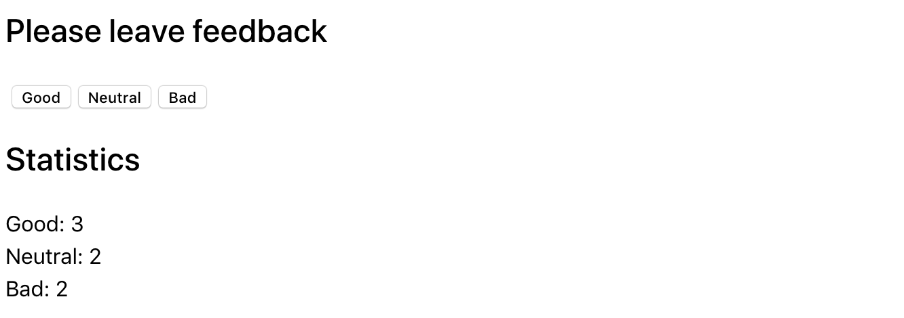

# 1 - Віджет відгуків

Як і більшість компаній, кафе **Expresso** збирає відгуки від своїх клієнтів.
Твоє завдання - створити додаток для збору статистики. Є лише три варіанти
зворотного зв'язку: `добре, нейтрально і погано`

## Крок 1

Застосунок повинен відображати кількість зібраних відгуків для кожної категорії.
Застосунок не повинен зберігати статистику відгуків між різними сесіями
(оновлення сторінки).

Стан застосунку обов'язково повинен бути наступного вигляду, додавати нові
властивості не можна.

```jsx
state = {
  good: 0,
  neutral: 0,
  bad: 0,
};
```

Інтерфейс може мати такий вигляд.



## Крок 2

Розшир функціонал застосунку таким чином, щоб в інтерфейсі відображалося більше
статистики про зібрані відгуки. Додай відображення загальної кількості зібраних
відгуків з усіх категорій та відсоток позитивних відгуків. Для цього створи
допоміжні методи countTotalFeedback() і countPositiveFeedbackPercentage(), які
підраховують ці значення, ґрунтуючись на даних у стані (обчислювані дані).


## Крок 3

Виконай рефакторинг застосунку. Стан застосунку повинен залишатися у кореневому
компоненті <App>.

Винеси відображення статистики в окремий компонент
`<Statistics good={} neutral={} bad={} total={} positivePercentage={}>`.

Винеси блок кнопок в компонент
`<FeedbackOptions options={} onLeaveFeedback={}>`.

Створи компонент `<Section title="">`, який рендерить секцію із заголовком і
дітей (children). Обгорни кожен із <Statistics> і <FeedbackOptions> у створений
компонент секції.

## Крок 4

Розшир функціонал застосунку таким чином, щоб блок статистики рендерився тільки
після того, як було зібрано хоча б один відгук. Повідомлення про відсутність
статистики винеси в компонент <Notification message="There is no feedback">.


# Виконання

## Підключення нормалайзеру (найоптимальніший варіант)

https://cdnjs.com/libraries/modern-normalize

```html
<link
  rel="stylesheet"
  href="https://cdnjs.cloudflare.com/ajax/libs/modern-normalize/2.0.0/modern-normalize.min.css"
  integrity="sha512-4xo8blKMVCiXpTaLzQSLSw3KFOVPWhm/TRtuPVc4WG6kUgjH6J03IBuG7JZPkcWMxJ5huwaBpOpnwYElP/m6wg=="
  crossorigin="anonymous"
  referrerpolicy="no-referrer"
/>
```

вставимо код в **index.html**

## Встановимо Styled Components:

`npm install styled-components`

# Настанови ментора:

- Основний стейт повинен бути в **`Арр`**:

```jsx
state = {
  good: 0,
  netural: 0,
  bad: 0,
};
```

- Метод для збільшення відгуків повинен бути ОДИН, використовувати попереднє
  значення стейту і основуватися на роботі з об'єктами

```jsx
this.setState(prevState => {
  return {
    [option]: prevState[option] + 1,
  };
});
```

- Компонент **FeedbackOptions** обов'язково повинен отримувати два props:
  `options={} onLeaveFeedback={}`. `options` це массив ключів iз `state`
- В компоненті **FeedbackOptions** обов'язково використовуйте метод `map` для
  створення розмітки При першому відкритті сторінки, коли немає ще відгуків,
  повідомлення `"There is no feedback"` потрібно рендерити по умові в **Арр**.
